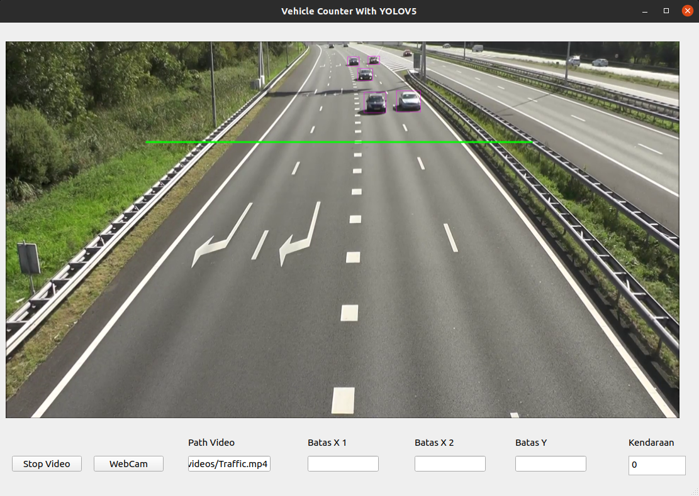

# VehicleCounter-Yolov5-PyQt

Vehicle Counter with OpenCV, Yolov5, and PyQt

## PyQt5

PyQt is a set of Python bindings for The Qt Company's Qt application framework and runs on all platforms supported by Qt including Windows, macOS, Linux, iOS and Android

## OpenCV

OpenCV (Open Source Computer Vision Library) is a library of programming functions mainly aimed at real-time computer vision

## YOLOv5

YOLO an acronym for 'You only look once', is an object detection algorithm that divides images into a grid system. Each cell in the grid is responsible for detecting objects within itself.

YOLO is one of the most famous object detection algorithms due to its speed and accuracy.
# MachineLearning
